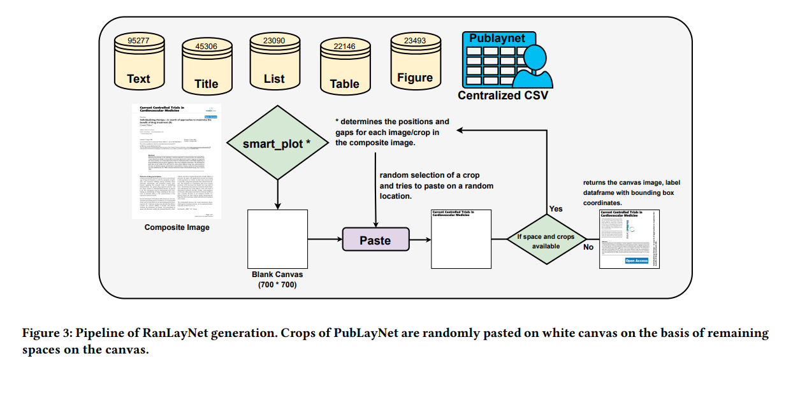

# RanLayNet: A Dataset for Document Layout Detection used for Domain Adaptation and Generalization

## INTRODUCTION

* Current layout detection datasets for deep learning lack diversity, necessitating a large number of annotated instances for training, resulting in high costs and time demands.
* Proposing RanLayNet, a synthetic document dataset with auto-assigned labels for layout elements, addressing challenges by offering a versatile dataset for robust model training across diverse document formats.
* Developed domain adaptation for layout identification using limited labeled data, improving a deep model trained on RanLayNet compared to models using only real documents.

## MOTIVATION AND CHALLENGES
* The limited diversity of layouts in Public datasets necessitates many annotated instances.
* Annotating enough instances for training is costly and time-consuming.
* Differences between source (training data) and target (real-world application) domains can greatly affect model performance.

## OUR SOLUTION
* Introduced RanLayNet, a synthetic document dataset.
* Dataset enriched with labels for spatial positions, ranges, and types of layout elements.
* Aim to create a dataset for training models adaptable and robust to various document formats.

## DATASET (RanLayNet)
* The dataset includes diverse layout classes, ensuring balanced representation and enhancing model’s ability to handle real-world layouts effectively.
* Deep learning models trained on RanLayNet provide insights into document layout, including spatial positions, extents, and element categories. Exposure to diverse layouts enhances their adaptability to real-world variations.
* RanLayNet's versatility enables training models for diverse layouts, effectively handling domain shifts in document structures. Models trained on RanLayNet outperform PublayNet models, showcasing robustness and adaptability to various layouts, reinforcing domain adaptation.

## METHODOLOGY FOR RANLAYNET DATASET GENERATION 

## RESULTS - Part 1 [ Inference on unseen DocLayNet Dataset using PubLayNet + RanLayNet ] 

* Yolo-v8 pretrained on PubLayNet as source-dataset
* Further fine-tuned on RanLayNet - our synthetic noisy dataset 
* Significantly enhances model performance across various metrics in different target domains.
* The performance stays consistent across various domains, thus leading to efficient domain adaptation

## RESULTS - Part 2 [ Inference on unseen DocLayNet Dataset using IIIT-AR-13K + RanLayNet] 

* Yolo-v8 pretrained on IIIT-AR-13K as source-dataset
* Further fine-tuned on RanLayNet - our synthetic noisy dataset 
* Significantly enhances model performance across various metrics in different target domains.
* The performance stays consistent across various domains, thus leading to efficient domain adaptation

## CONCLUSIONS : 

* Proposed "RanLayNet" as an innovative and unbiased dataset creation approach. 
* Dynamic and adaptable, designed without a predetermined layout structure. 
* Leveraged RanLayNet and a generality paradigm to revolutionize domain adaptation strategies.
* Holds promise for groundbreaking results and contributes significantly to advancing the field of domain adaptation in a dynamic and evolving data landscape.

## FUTURE SCOPE
* The current implementation, with five labels, demonstrates promising adaptability on the target domain. 
* Our trajectory involves a progressive evolution, intending to introduce diverse patches on our canvas. 
* This expansion aims to enable seamless generalization across a broader spectrum of domains, even without explicit label generation for both the source and target datasets.

